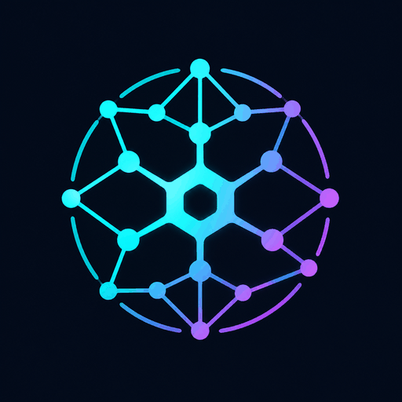

<p align="center">
  
</p>

# Codebase Memory V2

> **Hybrid code intelligence** — native WASM indexer (112 languages) + human memory graph + Obsidian vault sync.
> V1 (C engine, 158 languages) remains an optional, separately run database producer and reference; V2 never launches it automatically.

[](https://github.com/Cheurteenyt/codebase-mirror/actions/workflows/ci.yml)
[](LICENSE)

## What is this?

Codebase Memory V2 is a **hybrid** code intelligence system:

1. **Native WASM indexer** (V2) — 112 languages via tree-sitter WASM grammars. The most advanced semantic precision on TypeScript/JavaScript: cross-file CALLS resolution, module validity lock, type/value default separation, builtin truth lock. Semantics version 8.

2. **Human memory graph** (V2) — ADRs, bug notes, refactor plans, conventions, legacy zone markers, risk assessments, activity journal — synced to an Obsidian-compatible Markdown vault.

3. **V1 C engine** (separate producer/reference) — 158 languages via tree-sitter C. If an operator runs V1 separately, V2 can read the resulting compatible SQLite database via `CodeGraphReader`.

V2 performs native indexing without invoking V1. It does not automatically fall back to V1, merge V1 and V2 output, or create a V1 database on demand.

## Current version

See `v2/package.json` and `v2/CHANGELOG.md` for the authoritative version, test counts, and bug/optimization history.

## Quick start

Requires Node.js >= 22.12.0. The repository's `.nvmrc` and `.node-version`
select Node 24 LTS for development.

```bash
cd v2
npm ci

# Backend CLI + MCP server only
npm run build
npm test                    # see v2/CHANGELOG.md for current test count

# Index a project natively (no V1 needed for TS/JS)
node dist/cli/index.js index --project my-app --root /path/to/repo
node dist/cli/index.js index --project my-app --root /path/to/repo --incremental

# Try the demo
node dist/cli/index.js demo

# Initialize your project
node dist/cli/index.js init --project my-app

# Run diagnostics
node dist/cli/index.js doctor --project my-app

# Build the complete package, including the Graph UI, before starting it
npm run build:package
node dist/cli/index.js ui --project my-app
# Permit Control to browse/index a repository outside your home directory
node dist/cli/index.js ui --project my-app --allowed-root /srv/repos
```

`npm ci` installs dependencies but does not put this package's own `cbm-v2`
binary on your `PATH`. Use `node dist/cli/index.js` from a source checkout, as
above, or run `npm link` once if you prefer the shorter `cbm-v2` command.

## CLI reference

### Core commands

| Command | Description |
|---|---|
| `cbm-v2 index --project <p> --root <r>` | Index a project natively (WASM, 112 languages) |
| `cbm-v2 index --project <p> --root <r> --incremental` | Fast incremental index (skip unchanged files) |
| `cbm-v2 index --project <p> --root <r> --discovery-mode fast` | Explicit reduced-coverage full rebuild for benchmarks/speed-sensitive runs; incompatible with `--incremental` |
| `cbm-v2 index --project <p> --root <r> --dry-run` | Preview without writing to DB |
| `cbm-v2 init` | Initialize `.codebase-memory.json` configuration |
| `cbm-v2 doctor` | Run diagnostics (Node version, DB, vault path) |
| `cbm-v2 stats` | Show a pretty statistics dashboard |
| `cbm-v2 demo` | Create a demo project with sample notes + vault |
| `cbm-v2 mcp` | Run as MCP server (JSON-RPC over stdio) |
| `cbm-v2 ui [--allowed-root <paths...>]` | Start the graph UI web server (port 9749); optionally allow additional local browse/index roots |
| `cbm-v2 watch` | Watch vault for changes and auto-sync (daemon) |

### Human memory commands

| Command | Description |
|---|---|
| `cbm-v2 human create --type ADR --title "ADR-001: ..."` | Create a note |
| `cbm-v2 human list [--type ADR] [--status active]` | List notes |
| `cbm-v2 human show <id>` | Show a note (JSON, includes edges) |
| `cbm-v2 human link <noteId> --to-cbm-node <id> --edge DECIDES` | Link note to code node |

### Obsidian commands

| Command | Description |
|---|---|
| `cbm-v2 obsidian init` | Create vault directory structure |
| `cbm-v2 obsidian sync` | Bidirectional sync (DB ↔ vault) |
| `cbm-v2 obsidian sync --dry-run` | Preview without writing |
| `cbm-v2 obsidian sync --direction export` | Export only (DB → vault) |
| `cbm-v2 obsidian sync --direction import` | Import only (vault → DB) |
| `cbm-v2 obsidian export` | One-shot export (DB → vault) |
| `cbm-v2 obsidian import` | One-shot import (vault → DB) |
| `cbm-v2 obsidian report` | Vault file report (by directory) |
| `cbm-v2 obsidian create-adr --title "ADR-003: ..."` | Create ADR + DB record |
| `cbm-v2 obsidian create-module-note --module auth` | Create ModuleNote |
| `cbm-v2 obsidian create-route-note --method POST --path /api/login` | Create RouteNote |

### Report commands

| Command | Description |
|---|---|
| `cbm-v2 report hotspots` | Critical modules (high degree + complexity) |
| `cbm-v2 report undocumented` | Code nodes without human notes |
| `cbm-v2 report risk` | High coupling, dead code, fragile interfaces |

### Backup commands

| Command | Description |
|---|---|
| `cbm-v2 backup export --output backup.json` | Export all notes + edges to JSON |
| `cbm-v2 backup import backup.json` | Import from JSON backup |
| `cbm-v2 backup import backup.json --dry-run` | Preview import |

## MCP tools (7)

The `cbm-v2 mcp` command exposes 7 tools via JSON-RPC 2.0 over stdio:

| Tool | Type | Description |
|---|---|---|
| `get_project_overview` | read | High-level project stats (nodes, notes, coverage, freshness) |
| `get_module_context` | read | Full module context: code + human notes + ADRs + bugs + refactors |
| `get_undocumented_hotspots` | read | Critical code nodes without documentation |
| `create_human_note` | write | Create ADR/BugNote/etc. + link to code nodes |
| `link_note_to_code_node` | write | Link existing note to a code node |
| `search_code_and_memory` | read | Unified search across code graph + human memory |
| `prepare_edit_context` ⭐ | read | **Flagship** — call BEFORE editing any file. Returns code structure, dependencies, human notes, blast radius, risk score, freshness, and recommendations |

### Connecting an AI agent

Add to your MCP client config (Claude Desktop, Cursor, Zed, etc.):

```json
{
  "mcpServers": {
    "codebase-memory-v2": {
      "command": "node",
      "args": ["/absolute/path/to/codebase-mirror/v2/dist/cli/index.js", "mcp", "--project", "my-app"]
    }
  }
}
```

For Codex, add a local STDIO server to `~/.codex/config.toml` or to a trusted
project's `.codex/config.toml` after running `npm run build`:

```toml
[mcp_servers.codebase_memory_v2]
command = "node"
args = ["/absolute/path/to/codebase-mirror/v2/dist/cli/index.js", "mcp", "--project", "my-app"]
```

On Windows, the global file is `%USERPROFILE%\.codex\config.toml`. Use an
absolute path with forward slashes, for example
`D:/Mycodex/codebase-mirror/v2/dist/cli/index.js`, or escape each backslash in
the TOML string. Restart Codex after editing the configuration, then use
`codex mcp list` or `/mcp` to verify the connection.

## How it works

```
┌──────────────────────────────────────────────────────────────┐
│  Codebase Memory V2 (hybrid)                                 │
├──────────────────────────────────────────────────────────────┤
│                                                              │
│   ┌─────────────────────────┐  ┌──────────────────────────┐  │
│   │  V2 Native Indexer      │  │  V1 C Engine (separate)  │  │
│   │  tree-sitter WASM       │  │  tree-sitter C           │  │
│   │  112 languages          │  │  158 languages           │  │
│   │  cross-file resolver    │  │  DB producer/reference   │  │
│   │  semantics v8           │  │                          │  │
│   └───────────┬─────────────┘  └──────────┬───────────────┘  │
│               │                           │                  │
│               v                           v                  │
│   ┌─────────────────────────────────────────────────────────┐│
│   │  SQLite code graph (produced by one indexer per run)    ││
│   └─────────────────────────────────────────────────────────┘│
│               │                                              │
│               v                                              │
│   ┌─────────────────────────────────────────────────────────┐│
│   │  V2 Human Memory Layer                                  ││
│   │  Human Memory DB • Obsidian vault sync • Graph UI       ││
│   │  7 MCP tools • Reports • Intelligence layer             ││
│   └─────────────────────────────────────────────────────────┘│
│                                                              │
│   Storage:                                                   │
│   ~/.cache/codebase-memory-mcp/                              │
│     <project>.db           ← code graph (V2 or separate V1)  │
│     <project>.human.db     ← human memory (V2, TS)           │
│   <repo>/.codebase-memory-vault/  ← Obsidian vault (MD)      │
│   <repo>/.codebase-memory.json    ← project config           │
└──────────────────────────────────────────────────────────────┘
```

## Native indexer (V2 WASM)

V2 includes a **native code indexer** that does NOT require the V1 C binary:

- **112 languages** via pre-built tree-sitter WASM grammars (`tree-sitter-wasm`)
- **Cross-file CALLS resolution** — persistent `call_sites`, `imports`, `exports` tables; resolver matches call-sites to definitions across files
- **Module validity lock** — detects duplicate exports, default marker collisions, unresolved star sources, invalid builtins
- **Type/value default separation** — `interface`/`type alias` defaults excluded from runtime count
- **Builtin truth lock** — `isBuiltin()` from `node:module`; `node:fake` rejected, `node:test` accepted
- **Incremental indexing** — content hash + mtime_ns fast-skip; deletion-only fast path
- **Parallel workers** — multi-threaded WASM parsing for large projects
- **Semantics versioning** — `CURRENT_EXTRACTOR_SEMANTICS_VERSION = 8`; incremental mode forces full reindex when extractor output changes
- **Discovery completeness lock** — `DiscoveryResult` with structured errors; partial discovery preserves the existing graph (no silent wipe)
- **Canonical root propagation** — symlinked roots produce `file_path` without `..`
- **File identity contract** — `dev:ino` dedup with `0:0` fallback; deterministic hardlink selection

### Limitations

- V2 native indexer is most precise on **TypeScript/JavaScript**. Other languages (Python, Go, Rust, etc.) are parsed structurally but without cross-file resolution.
- For V1's 158-language coverage and precision, run the V1 C binary separately to produce the project database before opening it from V2.
- The Graph UI overview is capped at 1,000 representatives for predictable
  transfer and simulation cost. Exact domain, community, and directory scopes
  are loaded in revision-bound pages; the full project is never transferred
  merely to inspect one scope. Selecting a community opens its exact symbols
  immediately, while the filesystem tree requests a distinct directory
  subtree so an identically named layout community cannot replace it.

## Human memory node types

| Label | Obsidian dir | Description |
|---|---|---|
| `ArchitectureNote` | `Architecture/` | Transverse architecture notes |
| `ADR` | `ADR/` | Architecture Decision Records |
| `BugNote` | `Bugs/` | Known bugs |
| `RefactorPlan` | `Refactor/` | Planned refactors |
| `LegacyNote` | `Legacy/` | Legacy zone markers |
| `Convention` | `Conventions/` | Coding/architecture conventions |
| `Prompt` | `Prompts/` | Useful prompts for AI agents |
| `JournalEntry` | `Journal/` | Activity journal |
| `ModuleNote` | `Modules/` | Notes attached to modules |
| `RouteNote` | `Routes/` | Notes attached to HTTP routes |
| `RiskNote` | `Architecture/` | Risk assessments |

## Vault format

Each note has two sections:

```markdown
---
type: adr
status: active
cbm_node_ids: [1234]
tags: [auth, security]
---

# ADR-001: Use JWT for authentication

## AUTO-GENERATED

> ⚠️ This section is controlled by Codebase Memory V2 and may be regenerated.
> Do not edit — your changes would be lost on the next sync.

### Metadata
- **Type**: ADR
- **Status**: active
- **Slug**: adr-001-use-jwt-for-authentication

### Links to code
- [[1234]] — Module:auth (`src/auth/index.ts:1`)

---

## HUMAN NOTES

> ✏️ This section belongs to the user. It will **never** be overwritten.

### Context
We needed a stateless auth mechanism.

### Decision
Use JWT tokens signed with HS256.
```

The `## HUMAN NOTES` section is **never** overwritten by V2. Edit it freely in Obsidian — the next sync preserves your edits.

## Graph UI

The V2 graph UI replaces V1's separate 3D Three.js scene with one bounded 2D
d3-force canvas and two task views over the same graph:

- **Dashboard tab** (default): KPIs, graph freshness, smart recommendations
- **Graph tab**: 2D force-directed canvas with filters, pan/zoom, node detail panel
  - **Structure** (default): domains contain bounded, informative community
    captions before zoom reveals individual symbols. Hovering or focusing a
    domain with the keyboard activates one progressive insight lens: its exact
    volume summary and related bundles remain visible while community captions
    are limited to that domain; the idle overview gains no permanent annotation
  - **Dependencies** (optional, persisted locally): exact-degree hubs form a
    deterministic constellation; selecting a symbol unfolds up to four visible
    incoming/outgoing relation layers around a focus pinned to the semantic
    origin, with unrelated nodes retained as dim outer context. Numbered rails
    expose hop depth, repeated directory lanes expose module context, and
    relation colors plus dash patterns are decoded by a selection-only legend.
    Incoming labels open to the left and outgoing labels to the right through
    three deterministic collision candidates. The selected frame is recomposed
    inside the canvas area left free by the fidelity HUD, action rail, guide,
    breadcrumb, and detail panel; panel/viewport resizes update that camera
    without reheating d3. Distant depths use monotonic compressed spacing and
    moderate fan-outs expand vertically, so constrained canvases can enlarge
    the directed frame without merging rails. The label budget follows
    available screen area and rejects text that would be clipped or hidden
    under persistent graph controls
  - **Exact scope** (on demand): selecting a community or filesystem directory
    replaces the representative frame with a revision-bound exact page inside
    the same canvas. The backend adds a deterministic directory -> file ->
    symbol plan computed from the complete exact membership, so the first page
    already shows the whole bounded architecture while drawing only the loaded
    symbols. Raw internal topology remains available immediately and dense
    scopes expose an explicit Load more action. Selecting a loaded symbol keeps
    that exact scope mounted, opens its detail, and emphasizes only the visible
    incident relations; keyboard community browsing skips file surfaces whose
    symbols have not been loaded yet
- **Projects tab**: Project list with node/edge counts and health status
- **Control tab**: System info

Both Graph views share one topology, canvas, d3 simulation object,
sampling/exactness labels, filters, selection, keyboard model, and detail APIs.
`Structure` follows server-authored domain/community anchors. Filesystem tree
paths remain a separate exact `directory` scope even when a community has the
same key; its breadcrumb returns to the parent domain without relabeling
sampled data as exact. `Dependencies`
reconfigures that same simulation with task-specific targets and one bounded
reheat when the view or focused symbol changes; known filter subsets do not
reheat and no renderer, canvas, or node object is rebuilt. Direct relations lead
the focused frame while real depths 2–4 retain their semantic line grammar at a
lower weight; cross-links that do not advance toward or away from the focus are
not promoted as flow. Focus-label ranking is precomputed on semantic-frame
changes rather than sorted during every Canvas paint.

Large unselected Dependencies overviews keep every sampled node visible and
clickable, but only semantic hubs participate in d3 relaxation. Micro-symbols
remain on their deterministic constellation targets, nodes are painted in
spectral/rank batches, and secondary edges appear only when projected spacing
makes them useful. Selecting a symbol or returning to `Structure` restores
the complete node set to the same simulation before applying that view's
forces. This adaptive boundary reduces sustained CPU without changing the API
sample, exact-neighborhood behavior, filters, or hit targets.

The quiet Dependencies constellation is also a project map rather than an
undifferentiated particle ring. Major top-level paths occupy contiguous
elliptical sectors with
bounded colored arcs and exact representative counts; tiny paths collapse into
one unlabeled `other` sector. Hub halos and the backbone remain visible, while
the overview admits at most 12 radially anchored, collision-checked symbol
labels and rejects generic names such as `now`, `close`, and `handle`. Sector,
hub, and label plans are computed only when the semantic frame changes, not on
Canvas paints. Inside those sectors, at most six server-authored communities
with four or more shown nodes receive a muted path/count caption anchored to
their highest-ranked informative symbol. These captions reuse the same collision
boxes as sector, hub, and symbol labels. Non-semantic inner guide rings are
omitted, so every persistent mark now carries project, community, degree, type,
status, or relation meaning.

```bash
# From v2/ in a source checkout
npm run build:package
node dist/cli/index.js ui --project my-app

# Or, after npm link / a global install
cbm-v2 ui --project my-app --port 8080
# Add repositories outside the user's home directory to the Control allowlist
cbm-v2 ui --project my-app --allowed-root /srv/repos /mnt/work
```

Open `http://127.0.0.1:9749/` for the project selector, or go directly to
`http://127.0.0.1:9749/?tab=graph&project=my-app` for the interactive graph.
The home directory and the selected project's indexed root are allowed by
default. Additional Control-tab browse/index roots must be granted explicitly
with `--allowed-root`; paths are canonicalized before containment checks.

## Docker

```bash
# Build
docker build -t cbm-v2 .

# Run CLI
docker run --rm cbm-v2 --help
docker run --rm cbm-v2 demo

# Run MCP server (mount cache volume)
docker run --rm -i -v cbm-cache:/home/node/.cache/codebase-memory-mcp cbm-v2 mcp --project my-app
```

## Documentation

### Architecture & Current State
- [V2 Architecture](docs/V2_ARCHITECTURE.md) — Hybrid indexer, discovery, resolver, semantics
- [V2 Current State](docs/V2_CURRENT_STATE.md) — Versions, stable features, limitations, blockers
- [V2 Roadmap](docs/V2_ROADMAP.md) — Historical archive (0.15.9 era)
- [Obsidian Integration](docs/OBSIDIAN_INTEGRATION.md) — Vault format and sync
- [Human Memory Schema](docs/HUMAN_MEMORY_GRAPH_SCHEMA.md) — SQL schema

### Reference
- [MCP Tools](docs/MCP_TOOLS.md) — All 7 MCP tools with input/output examples
- [CLI Reference](docs/CLI_REFERENCE.md) — All CLI commands including `cbm-v2 index`
- [Intelligence Layer](docs/INTELLIGENCE.md) — Graph awareness + prepare_edit_context
- [Token Economy](docs/TOKEN_ECONOMY.md) — Historical v0.15.9 workflow estimates (-67% to -87%), not a current transport benchmark
- [Performance, Token, and UI Audit](docs/PERFORMANCE_TOKEN_UI_AUDIT_2026-07-15.md) — Current compact-vs-pretty whitespace transport measurement

### Project
- [Contributing](CONTRIBUTING.md) — How to contribute
- [Maintainers Guide](MAINTAINERS_GUIDE.md) — Internal conventions and invariants
- [AI Collaboration Protocol](docs/AI_COLLABORATION_PROTOCOL.md) — External audits, GLM checkpoints, and reset recovery
- [License](LICENSE) — MIT

## Security

- **Local-first**: no network calls, no telemetry
- **HUMAN NOTES preserved**: the `## HUMAN NOTES` section is never overwritten (regression-tested)
- **Path traversal protection**: `obsidian_path` validated against `..` and backslashes; `assertPathInsideRoot` uses `path.relative` for cross-platform containment
- **Discovery completeness lock**: partial discovery (subtree EACCES, fatal symlink errors) preserves the existing graph — no silent wipe. Broken symlinks (ENOENT) are treated as warnings, not fatal.
- **Alias history** (R153): when a symlink alias was previously valid and is now broken, the old canonical target's data is preserved via the `alias_history` table. Prevents silent historical-target deletion.
- **Warning propagation** (R152+R153): all discovery warnings (broken symlinks, ELOOP, TOCTOU races) are surfaced in `IndexResult.warnings` with root-relative paths. The CLI prints them even on success (`SUCCESS_WITH_WARNINGS` outcome).
- **Typed outcome** (R153): `IndexResult.outcome` is `SUCCESS` | `SUCCESS_WITH_WARNINGS` | `STALE` | `PARTIAL` | `FAILED`. Exit codes: 0 (success), 1 (errors), 2 (stale without errors).
- **Root discovery validation**: `assertDiscoveryRoot` verifies stat + isDirectory + realpath + readdir before any DB mutation
- **Backup rotation**: max 5 `.bak` files per note
- **Dry-run**: available on `obsidian sync`, `obsidian export`, `obsidian import`, `backup import`
- **Consistent sync hashes**: `markSynced` computes the same DB-derived hash for both export and import directions, making conflict detection reliable (R14 fix)

## Performance

- **N+1 query elimination**: all hot paths use bulk fetches (`getBulkNotesByCbmNodeIds`, `getBulkNodeDegrees`, `getBulkEdges`)
- **SQL-level limit**: `getBulkNotesByCbmNodeIds` uses `ROW_NUMBER() OVER (PARTITION BY ...)` to cap per-node at the database level
- **Incremental indexing**: content hash + mtime_ns fast-skip; deletion-only fast path avoids re-parsing unchanged files
- **Parallel workers**: multi-threaded WASM parsing for projects with >20 changed files
- **Stable UI listeners**: `GraphCanvas` uses refs for callbacks — no listener rebinds on filter toggle

## License

MIT — see [LICENSE](LICENSE).
